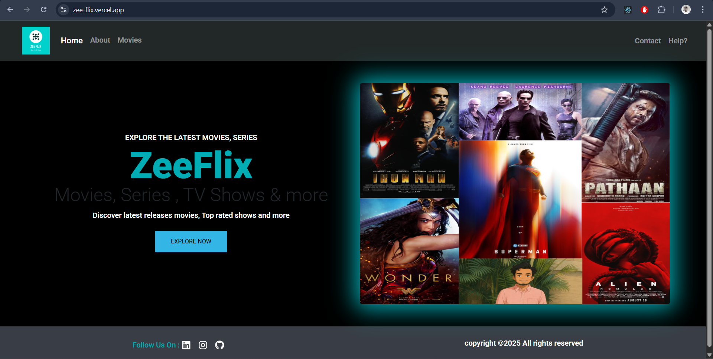
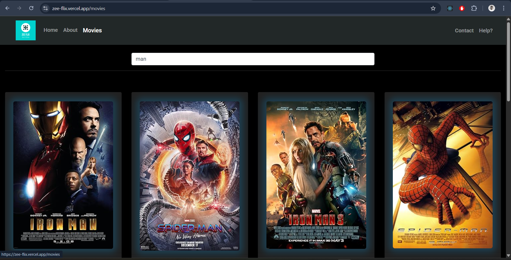

# ZeeFlix 🎬

ZeeFlix is a modern React-based web application for exploring movies, series, and TV shows. It features search, details, and curated lists powered by the OMDb API.

---

## Table of Contents

- [Features](#features)
- [Screenshots](#screenshots)
- [Getting Started](#getting-started)
- [Environment Variables](#environment-variables)
- [Project Structure](#project-structure)
- [Scripts](#scripts)
- [Tech Stack](#tech-stack)
- [Configuration Files](#configuration-files)
- [Contributing](#contributing)
- [License](#license)
- [Contact](#contact)

---

## Features

- 🔍 Search movies, series, and TV shows
- 📄 View detailed information for each title
- 🧑‍💻 Responsive UI with Bootstrap and custom styles
- ⚡ Shimmer loading effects for better UX
- 🚦 Error handling for failed API requests
- 🧭 Client-side routing with React Router
- 📱 Mobile-friendly design

---

## Screenshots




---

## Getting Started

### Prerequisites

- [Node.js](https://nodejs.org/) (v18+ recommended)
- [npm](https://www.npmjs.com/) or [yarn](https://yarnpkg.com/)

### Installation

1. **Clone the repository:**

   ```sh
   git clone https://github.com/yourusername/zee-flix.git
   cd zee-flix
   ```

2. **Install dependencies:**

   ```sh
   npm install
   # or
   yarn install
   ```

3. **Set up environment variables:**

   Create a `.env` file in the root directory and add your OMDb API credentials:

   ```
   VITE_API_URL=https://www.omdbapi.com/
   VITE_API_KEY=your_omdb_api_key
   VITE_QUERY=batman
   ```

4. **Run the development server:**

   ```sh
   npm run dev
   # or
   yarn dev
   ```

5. **Open [http://localhost:5173](http://localhost:5173) in your browser.**

---

## Environment Variables

- `VITE_API_URL`: Base URL for OMDb API (default: `https://www.omdbapi.com/`)
- `VITE_API_KEY`: Your OMDb API key
- `VITE_QUERY`: Default search query (e.g., `batman`)

---

## Project Structure

```
zee-flix/
├── public/
│   └── zee-flix-high-resolution-logo.png
├── src/
│   ├── assets/
│   ├── component/
│   │   ├── movie/
│   │   │   ├── [Card.jsx](http://_vscodecontentref_/0)
│   │   │   ├── [MovieDetails.jsx](http://_vscodecontentref_/1)
│   │   │   └── [MoviesList.jsx](http://_vscodecontentref_/2)
│   │   └── pages/
│   │       ├── [About.jsx](http://_vscodecontentref_/3)
│   │       ├── [Contact.jsx](http://_vscodecontentref_/4)
│   │       ├── [ErrorList.jsx](http://_vscodecontentref_/5)
│   │       ├── [ErrorPage.jsx](http://_vscodecontentref_/6)
│   │       ├── [Footer.jsx](http://_vscodecontentref_/7)
│   │       ├── [Home.jsx](http://_vscodecontentref_/8)
│   │       ├── [MovieShimmer.jsx](http://_vscodecontentref_/9)
│   │       ├── [Navbar.jsx](http://_vscodecontentref_/10)
│   │       ├── [Search.jsx](http://_vscodecontentref_/11)
│   │       └── [Shimmer.jsx](http://_vscodecontentref_/12)
│   ├── [App.jsx](http://_vscodecontentref_/13)
│   ├── [App.css](http://_vscodecontentref_/14)
│   ├── [index.css](http://_vscodecontentref_/15)
│   └── [main.jsx](http://_vscodecontentref_/16)
├── .env
├── [package.json](http://_vscodecontentref_/17)
├── [vite.config.js](http://_vscodecontentref_/18)
├── [vercel.json](http://_vscodecontentref_/19)
└── [README.md](http://_vscodecontentref_/20)
```

---

## Scripts

- `npm run dev` — Start development server
- `npm run build` — Build for production
- `npm run preview` — Preview production build
- `npm run lint` — Run ESLint

---

## Tech Stack

- **Frontend:** HTML, CSS,JavaScript, React, React Router, Bootstrap, MDBootstrap, FontAwesome, React Icons, Axios
- **API:** [OMDb API](https://www.omdbapi.com/)
- **Tooling:** Vite, ESLint

---

## Configuration Files

- [`vite.config.js`](vite.config.js): Vite configuration for React.
- [`eslint.config.js`](eslint.config.js): ESLint configuration for code linting.
- [`vercel.json`](vercel.json): Vercel rewrite rules for deployment.
- [`.gitignore`](.gitignore): Files and folders to ignore in git.
- [`index.html`](index.html): Main HTML file for the app.

---

## Main Components

- [`src/App.jsx`](src/App.jsx): Main app component and router setup.
- [`src/main.jsx`](src/main.jsx): Entry point for React rendering.
- [`src/component/movie/MoviesList.jsx`](src/component/movie/MoviesList.jsx): Movie list and search logic.
- [`src/component/movie/MovieDetails.jsx`](src/component/movie/MovieDetails.jsx): Movie details page.
- [`src/component/movie/Card.jsx`](src/component/movie/Card.jsx): Movie card component.
- [`src/component/pages/Navbar.jsx`](src/component/pages/Navbar.jsx): Navigation bar.
- [`src/component/pages/Footer.jsx`](src/component/pages/Footer.jsx): Footer section.
- [`src/component/pages/Home.jsx`](src/component/pages/Home.jsx): Home page.
- [`src/component/pages/About.jsx`](src/component/pages/About.jsx): About page.
- [`src/component/pages/Contact.jsx`](src/component/pages/Contact.jsx): Contact page.
- [`src/component/pages/ErrorPage.jsx`](src/component/pages/ErrorPage.jsx): 404 error page.
- [`src/component/pages/ErrorList.jsx`](src/component/pages/ErrorList.jsx): Error display for movie search.
- [`src/component/pages/Search.jsx`](src/component/pages/Search.jsx): Search input component.
- [`src/component/pages/Shimmer.jsx`](src/component/pages/Shimmer.jsx): Shimmer loading effect for movie cards.
- [`src/component/pages/MovieShimmer.jsx`](src/component/pages/MovieShimmer.jsx): Shimmer loading effect for movie details.

---

## Styling

- [`src/App.css`](src/App.css): App-wide styles and shimmer effects.
- [`src/index.css`](src/index.css): Global styles and custom classes.

---

## Deployment

- The project is ready for deployment on [Vercel](https://vercel.com/) using [`vercel.json`](vercel.json).
- For other platforms, ensure proper rewrite rules for SPA routing.

---

## Contributing

Contributions are welcome! Please open issues or submit pull requests for improvements and bug fixes.

---

## License

This project is licensed under the [MIT License](LICENSE).

---

## Contact

- **Author:** Zeeshan Raza
- **LinkedIn:** [zeeshanraza01](https://www.linkedin.com/in/zeeshanraza01)
- **GitHub:** [raza-zeeshan](https://github.com/raza-zeeshan)
- **LeetCode:**[Zeeshan_Raza_44](https://leetcode.com/u/Zeeshan_Raza_44/)
- **Email:** zeeshanraza0201@gmail.com

---

> Made with ❤️ for movie lovers.
